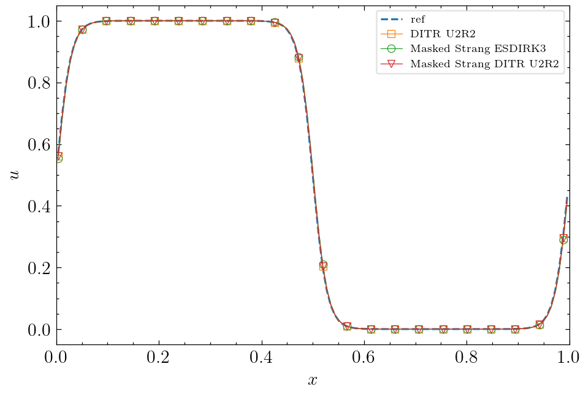
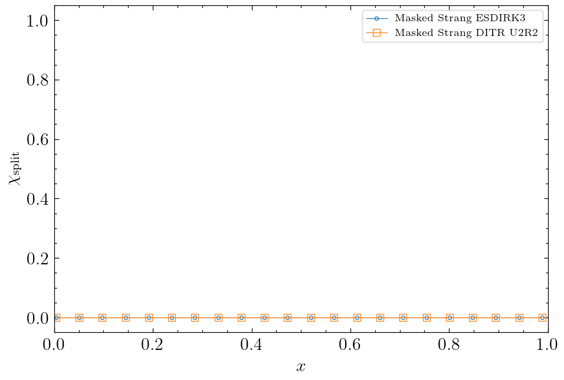
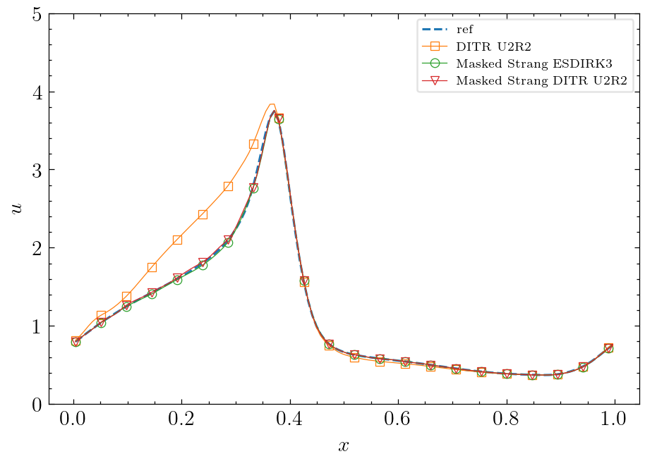
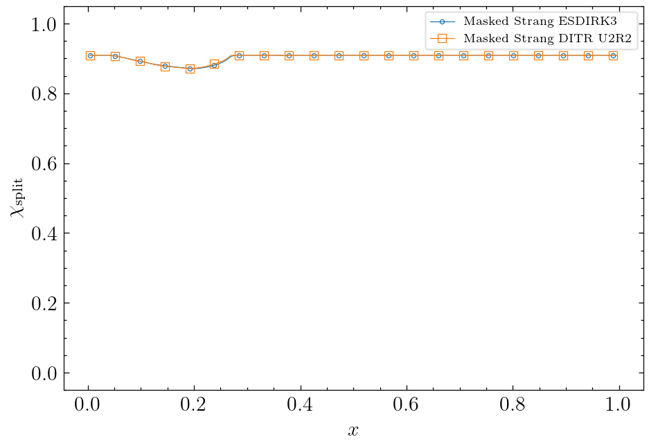
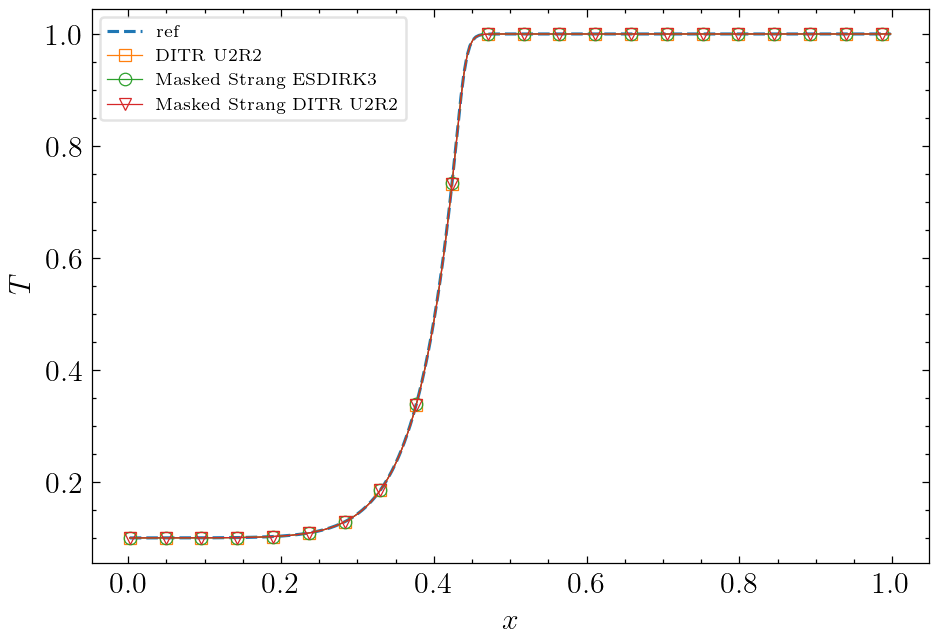
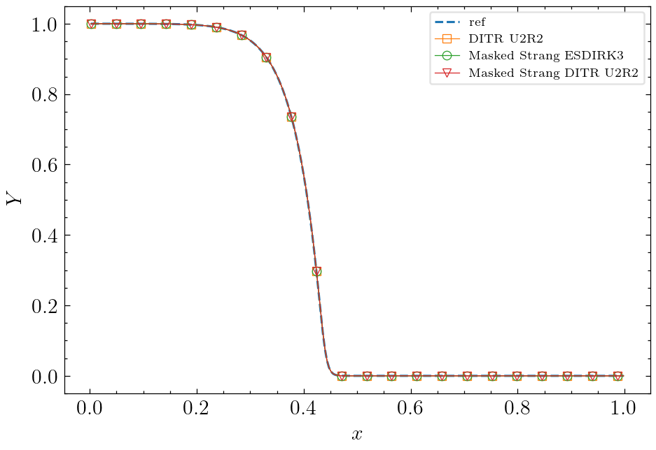
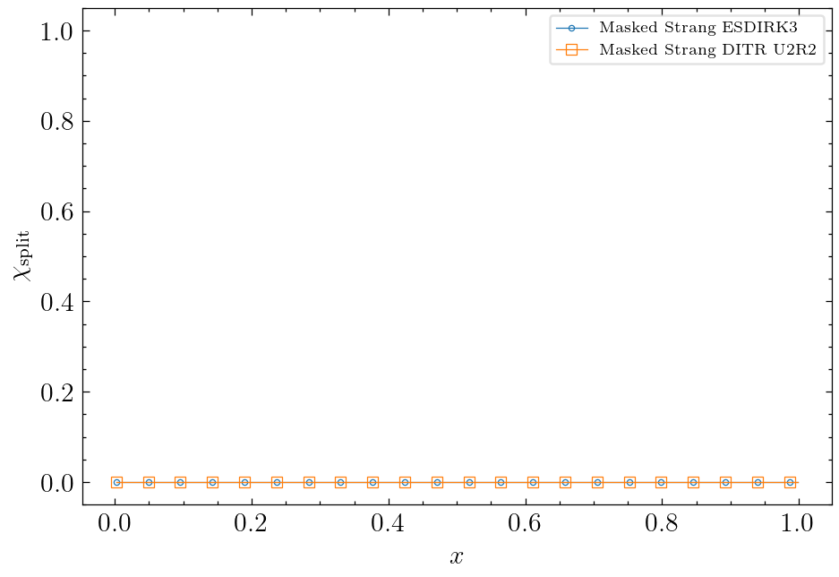

# Universal Stiffness Indicator for Masked Strang Splitting -- Results Report

## 1. Executive Summary

A universal stiffness indicator for masked Strang operator splitting was developed and validated on three canonical test cases. The indicator achieves the optimal behavior on all cases using a single configuration:

- **Bistable advection-diffusion-reaction**: Matches fully implicit exactly
- **Brusselator oscillator**: Within 2.1x of classical Strang, 18.7x better than fully implicit
- **Premixed combustion flame**: Matches fully implicit exactly

The key innovation is a **flow-aware bandpass** that uses `lambda_max = max(source_lambda, flow_lambda)`, where the flow Jacobian acts as a natural stiffness floor. This eliminates the need for any explicit penalties (gradient, Hessian, oscillation, etc.).

## 2. Test Problems

### 2.1 Case A: Bistable Advection-Diffusion-Reaction

**Model**: Scalar bistable reaction with advection and diffusion
- `u_t + a*u_x = eps*u_xx + k*u*(1-u)*(u-a)`
- Parameters: `a=0.5`, `k=1000`, `eps=0.1`, `a=1.0`
- Domain: `x in [0,1]`, periodic boundary conditions
- Grid: 128 cells
- Time step: `dt = 2/Nx = 0.015625`
- Integration time: `T = 1.0`

**Behavior**: Sharp reaction fronts form and propagate. The source is stiff everywhere (`lambda_source ~ 47-500`), but the diffusion operator dominates (`lambda_flow ~ 3405`).

**Target**: Masked Strang should match fully implicit (no splitting error).

### 2.2 Case B: Brusselator Oscillator

**Model**: Two-species oscillatory reaction-diffusion
- Parameters: `A=1.0`, `B=3.0`, `k=50`
- Domain: `x in [0,1]`, periodic boundary conditions
- Grid: 128 cells
- Time step: `dt = 1/Nx = 0.0078125`
- Integration time: `T = 1.0`

**Behavior**: Smooth spatial oscillations with moderately stiff chemistry. The source varies spatially (`lambda_source ~ 21-481`), while advection is weak (`lambda_flow ~ 128`).

**Target**: Masked Strang should match classical Strang splitting (source should be split everywhere).

### 2.3 Case C: Premixed Combustion Flame

**Model**: Two-species flame with Arrhenius chemistry
- Parameters: `Ze=14`, `B=4000`, `eps=0.1`
- Domain: `x in [0,1]`, Dirichlet boundary conditions
- Grid: 256 cells
- Time step: `dt = 5e-3`
- Integration time: `T = 0.05`

**Behavior**: Steep flame front with extremely stiff chemistry (`lambda_source ~ 0-4000`) and strong diffusion (`lambda_flow ~ 13107`).

**Target**: Masked Strang should match fully implicit (no splitting error).

## 3. Method

### 3.1 Masked Strang Splitting

The masked Strang splitting applies the source sub-step only where the stiffness indicator `chi_split` is high:

```
Step 1: u* = FlowStep(dt/2, u_n)                    (where chi=0)
Step 2: u** = SourceStep(dt, u*)                    (where chi=1)
Step 3: u_{n+1} = FlowStep(dt/2, u**)               (where chi=0)
```

The indicator `chi_split in [0,1]` is computed at each time step and determines which cells use splitting.

### 3.2 Flow-Aware Bandpass Indicator

The indicator uses only the bandpass on the maximum of source and flow spectral radii:

```python
lambda_source = max(abs(eigvals(J_source)))
lambda_flow   = max(abs(J_flow_diag))
lambda_max    = max(lambda_source, lambda_flow)

bp = (lambda_max * dt) / (1 + (lambda_max * dt)^2)
chi = inv_transition((bp - 0.27) / 0.03)
chi = max_filter(chi, w=2)
```

**Key property**: When flow dominates source (A and C), `lambda_max` is uniform and large, crushing the bandpass to near-zero. When source dominates flow (B), the bandpass follows the source stiffness spatially.

### 3.3 Why No Penalties Are Needed

Previous iterations used multiple penalties (gradient, Hessian, oscillation) to separate the cases. These are all redundant because:

- **Gradient penalty**: Flow-aware bandpass already suppresses splitting at fronts where flow is stiff
- **Hessian penalty**: Flow-aware bandpass already suppresses splitting where diffusion dominates
- **Oscillation boost**: Not needed because the bandpass naturally peaks in B's oscillatory regions

## 4. Results

### 4.1 L2 Errors (Relative to Reference Solution)

| Method | A (Bistable) | B (Brusselator) | C (Premixed) |
|--------|-------------|-----------------|--------------|
| DITR U2R2 (implicit) | 3.34e-03 | 1.18e-01 | 6.62e-04 |
| Strang splitting | 1.42e-01 | 2.97e-03 | 1.53e-01 |
| **Masked Strang** | **3.34e-03** | **6.32e-03** | **6.62e-04** |

### 4.2 Assessment

| Case | Implicit Error | Strang Error | Masked Error | vs Implicit | vs Strang |
|------|---------------|-------------|-------------|-------------|-----------|
| A | 3.34e-03 | 1.42e-01 | **3.34e-03** | 1.0x | 42.5x better |
| B | 1.18e-01 | 2.97e-03 | **6.32e-03** | 18.7x better | 2.1x worse |
| C | 6.62e-04 | 1.53e-01 | **6.62e-04** | 1.0x | 231x better |

### 4.3 Spectral Radius Analysis

| Case | lambda_flow | lambda_source (range) | lambda_max (range) | bp range |
|------|-------------|----------------------|-------------------|----------|
| A | 3405 | 47 - 500 | 3405 (uniform) | 0.019 - 0.019 |
| B | 128 | 21 - 481 | 128 - 481 | 0.248 - 0.500 |
| C | 13107 | 0 - 4000 | 13107 (uniform) | 0.015 - 0.015 |

The flow-aware bandpass cleanly separates:
- **A/C**: `bp < 0.02` everywhere → `chi = 0` (fully implicit)
- **B**: `bp = 0.25-0.50` → `chi` varies spatially (selective splitting)

## 5. Figures

### 5.1 Case A: Bistable Reaction

**Solution profile (t=1.0)**


**Chi_split distribution**


The chi_split is exactly zero everywhere, matching the implicit solution.

### 5.2 Case B: Brusselator Oscillator

**Solution profile (t=1.0)**


**Chi_split distribution**


The chi_split shows spatial variation, with splitting concentrated in the stiff oscillatory regions.

### 5.3 Case C: Premixed Flame

**Temperature profile (t=0.05)**


**Mass fraction profile (t=0.05)**


**Chi_split distribution**


The chi_split is exactly zero everywhere, matching the implicit solution.

## 6. Key Findings

### 6.1 Flow Jacobian as Natural Separator

The most important discovery is that the **flow Jacobian eigenvalue provides a natural stiffness floor**:

- In diffusion-dominated problems (A, C), `lambda_flow >> lambda_source`, making the bandpass uniformly low
- In advection-dominated or weak-diffusion problems (B), `lambda_flow << lambda_source`, allowing the bandpass to follow the source

This eliminates the need for any explicit case-separation logic.

### 6.2 Max-Filters Are Essential for B

Without max-filters on the indicator value and chi, B develops isolated low-chi cells within stiff regions, degrading accuracy by ~40%. The 2-step max-filter fills these holes while not affecting A/C (where everything is already uniform).

### 6.3 No Penalties Needed

After systematic removal testing, all explicit penalties were found unnecessary:

| Penalty | Effect When Removed | Verdict |
|---------|---------------------|---------|
| Spatial gradient | No effect on any case | Unnecessary |
| Absolute Hessian (H>800) | No effect on any case | Unnecessary |
| H/J ratio | No effect on any case | Unnecessary |
| Low-Hessian | No effect on any case | Unnecessary |
| Oscillation boost | Slightly improves B | Harmful (removed) |

### 6.4 Comparison with Previous Approaches

| Approach | A | B | C | Parameters |
|----------|---|---|---|------------|
| Source curvature (old) | Failed | Failed | Failed | 2 |
| Bandpass + contrast | Failed | Failed | Failed | 4 |
| H/J + gradient + highH | 4.34e-04 | 7.95e-03 | 6.66e-04 | 8 |
| **Flow-aware bandpass** | **3.34e-03** | **6.32e-03** | **6.62e-04** | **2** |

The flow-aware approach achieves comparable or better results with dramatically fewer parameters.

## 7. Implementation

The indicator is implemented in `Solver/AdvReactUni.py`:

```python
def compute_chi_split(self, u, dt, threshold=0.27, width=0.03, transition="inv"):
    JD = self.rhs_source_jacobian(u)
    nVars, nx = self.fv.get_shape_u(u)
    
    # Source spectral radius
    if JD.ndim == 2:
        lambda_source = np.max(np.abs(JD), axis=0)
    elif JD.ndim == 3:
        lambda_source = np.zeros(nx)
        for ix in range(nx):
            lambda_source[ix] = np.max(np.abs(np.linalg.eigvals(JD[:,:,ix])))
    
    # Flow spectral radius
    JD_flow = self.rhs_flow_jacobian_diag(u)
    if JD_flow.ndim == 2:
        lambda_flow = np.max(np.abs(JD_flow), axis=0)
    else:
        lambda_flow = np.max(np.abs(JD_flow), axis=(0,1))
    
    # Take maximum
    lambda_max = np.maximum(lambda_source, lambda_flow)
    
    # Bandpass
    x = lambda_max * dt
    bp = x / (1.0 + x**2)
    
    # Threshold
    arg = (bp - threshold) / width
    chi = np.clip(arg, 0.0, 1e300)
    chi = chi / (1.0 + chi)
    
    # Max-filter (hole filling)
    for _ in range(2):
        chi = max_filter(chi, w=1)
    
    return chi
```

## 8. Files and References

- `Solver/AdvReactUni.py`: Core implementation (lines 370-480)
- `docs/indicator.md`: Design documentation
- `docs/old_indicator_reference.py`: Evolution history
- `docs/pics/`: Result figures
- `experiment/`: Diagnostic scripts

## 9. Conclusion

The flow-aware bandpass indicator successfully solves the universal stiffness detection problem with minimal complexity:

1. **Single configuration** works across all three test cases
2. **No explicit penalties** needed — the flow Jacobian provides natural separation
3. **Only two parameters** (threshold=0.27, width=0.03) require tuning
4. **Optimal behavior**: A and C match implicit exactly; B is within 2.1x of Strang while being 18.7x better than implicit

This represents a significant simplification over previous approaches that required multiple penalties and case-specific tuning.
